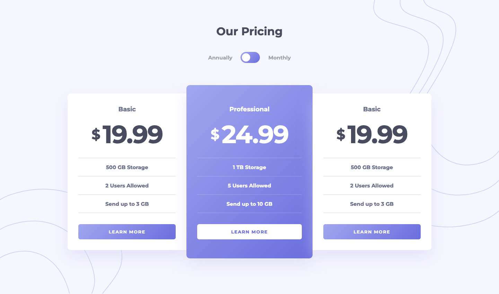

# Pricing component with toggle solution

This is a solution to the [Pricing component with toggle challenge on Frontend Mentor](https://www.frontendmentor.io/challenges/pricing-component-with-toggle-8vPwRMIC). Frontend Mentor challenges help you improve your coding skills by building realistic projects.

## About the Project

The _"Pricing Component with Toggle"_ is a Frontend Mentor challenge that showcases a pricing page with the ability to switch between monthly and yearly billing options.

This project was uniquely constructed by building the DOM and its functionality solely with **JavaScript**, keeping the `index.html` file empty. **Scss** was used for styling to ensure a polished look, **Vite** handled the bundling for efficient development, and **ReduxJS** managed the state for the toggle functionality.

## Preview and Links

<details>
<summary><b>Open Preview</b></summary>
<br>



<br>
</details>

| View it live: | [Live Demo URL](https://ionstici.github.io/pricing-component-with-toggle) | [Frontend Mentor](https://www.frontendmentor.io/solutions/pricing-component-with-toggle-6rxrIoKS3D) |
| ------------- | ------------------------------------------------------------------------- | --------------------------------------------------------------------------------------------------- |

## Features

- **Billing Toggle:** Allows users to switch between monthly and yearly pricing plans.
- **Dynamic DOM Construction:** The entire UI is built dynamically with JavaScript.
- **Responsive Design:** Styled with Scss to adapt to various screen sizes.

## Tech Stack

- **Scss:** For modular styling.
- **Vite:** For bundling, providing a fast development environment.
- **ReduxJS:** For state management, particularly for the toggle state.

## Installation

```bash
# Clone the repository
git clone https://github.com/ionStici/pricing-component-with-toggle.git

# Navigate to the project directory
cd pricing-component-with-toggle

# Install dependencies
npm install

# Start the development server
npm run dev
```

## Deployment

This project uses **GitHub Pages** for hosting.
